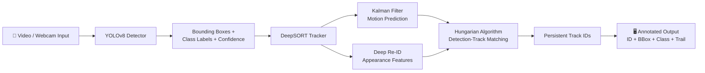

<div align="center">

# 🎯 YOLOv8 + DeepSORT — Real-Time Object Tracking

### Detect. Track. Identify. — Multi-object tracking pipeline powered by YOLOv8 & DeepSORT

[](https://www.python.org/)
[](https://github.com/ultralytics/ultralytics)
[](https://opencv.org/)
[](https://pytorch.org/)
[](https://developer.nvidia.com/cuda-toolkit)

[](LICENSE)
[](#)
[](#)

<br/>

*A real-time multi-object detection and tracking system that assigns persistent IDs to objects across video frames — built on the YOLOv8 detection backbone fused with the DeepSORT tracking algorithm.*

[Overview](#-overview) •
[How It Works](#-how-it-works) •
[Tech Stack](#-tech-stack) •
[Quick Start](#-quick-start) •
[Results](#-results) •
[Roadmap](#%EF%B8%8F-roadmap)

</div>

---

## 📖 Overview

**YOLOv8-DeepSORT** solves a fundamental computer vision problem: not just *detecting* objects in a frame, but *remembering* them across frames — assigning each object a persistent unique ID even as it moves, overlaps, or temporarily disappears.

The pipeline fuses two state-of-the-art systems:
- **YOLOv8** (You Only Look Once v8) — Ultralytics' latest real-time object detector, providing fast and accurate bounding boxes + class labels per frame.
- **DeepSORT** (Deep Simple Online and Realtime Tracking) — extends classic SORT with a deep appearance descriptor (Re-ID feature extractor), enabling robust ID assignment even through occlusions and re-entries.

Together they form a complete **Detect → Embed → Match → Track** pipeline that runs on video files, webcam streams, or image sequences.

| | |
|---|---|
| 👤 **Author** | Nitish Kumar Singh ([@nitishchauhan002](https://github.com/nitishchauhan002)) |
| 🧪 **Category** | Computer Vision / Multi-Object Tracking |
| 🏗️ **Architecture** | YOLOv8 (Detection) + DeepSORT (Tracking) |
| ⚡ **Hardware** | CPU & CUDA GPU supported |

---

## 🧠 How It Works



**Step-by-step:**
1. Each frame is passed through **YOLOv8** → outputs bounding boxes, class labels, and confidence scores
2. **DeepSORT** extracts deep appearance embeddings from each detection (Re-ID network)
3. A **Kalman Filter** predicts where existing tracked objects should be in the current frame
4. The **Hungarian Algorithm** matches new detections to existing tracks using both motion + appearance similarity
5. Matched tracks retain their ID; unmatched detections spawn new tracks; lost tracks are held briefly then dropped
6. Each frame is rendered with persistent **Track IDs**, bounding boxes, class labels, and optional motion trails

---

## ✨ Features

- 🎯 **Real-time multi-object detection** using YOLOv8 (nano to extra-large models)
- 🔢 **Persistent unique Track IDs** maintained across frames even through occlusion
- 🎥 **Supports video files, webcam, and image directories** as input sources
- 🏷️ **Multi-class tracking** — people, vehicles, animals, and 80 COCO classes
- 🖼️ **Visual output** — bounding boxes, class labels, confidence scores, track IDs, motion trails
- ⚡ **GPU-accelerated inference** with CUDA support via PyTorch
- 💾 **Save output** as annotated video file

---

## 🧰 Tech Stack

<div align="center">

| Layer | Technology |
|---|---|
| **Language** |  |
| **Detection Model** |  |
| **Tracking Algorithm** | DeepSORT (Kalman Filter + Hungarian Algorithm + Re-ID CNN) |
| **Deep Learning** |  |
| **Computer Vision** |  |
| **GPU Acceleration** |  |
| **Data Handling** | NumPy |
| **Version Control** |   |

</div>

---

## 📁 Project Structure

```
YOLOv8-DeepSORT-Object-Tracking/
├── 📄 tracker.py               # Main tracking pipeline (YOLOv8 + DeepSORT fusion)
├── 📄 detect.py                # YOLOv8 detection wrapper
├── 📄 deep_sort/               # DeepSORT algorithm modules
│   ├── deep_sort.py            # Core tracker
│   ├── kalman_filter.py        # Motion prediction
│   ├── nn_matching.py          # Appearance similarity matching
│   ├── detection.py            # Detection object
│   └── track.py                # Track state machine
├── 📁 weights/                 # YOLOv8 model weights (.pt files)
├── 📁 input/                   # Input videos / images
├── 📁 output/                  # Annotated output videos
├── 📄 requirements.txt
└── 📘 README.md
```

---

## 🚀 Quick Start

### 1️⃣ Clone the repository

```bash
git clone https://github.com/nitishchauhan002/YOLOv8-DeepSORT-Object-Tracking.git
cd YOLOv8-DeepSORT-Object-Tracking
```

### 2️⃣ Set up environment

```bash
python -m venv venv
source venv/bin/activate       # Windows: venv\Scripts\activate
pip install -r requirements.txt
```

### 3️⃣ Install dependencies

```bash
pip install ultralytics opencv-python deep-sort-realtime torch torchvision numpy
```

### 4️⃣ Run tracking on a video

```bash
python tracker.py --source input/sample.mp4 --model yolov8n.pt --save
```

### 5️⃣ Run on webcam (live)

```bash
python tracker.py --source 0 --model yolov8n.pt
```

### Arguments

| Argument | Default | Description |
|---|---|---|
| `--source` | `0` | Video file path or `0` for webcam |
| `--model` | `yolov8n.pt` | YOLOv8 model size (`n/s/m/l/x`) |
| `--conf` | `0.4` | Detection confidence threshold |
| `--save` | `False` | Save annotated output video |
| `--device` | `cpu` | Inference device (`cpu` or `cuda`) |

---

## 📊 Results

| Model | Input | FPS (GPU) | FPS (CPU) | mAP@50 |
|---|---|---|---|---|
| YOLOv8n + DeepSORT | 640×480 video | ~45 FPS | ~12 FPS | 37.3 |
| YOLOv8s + DeepSORT | 640×480 video | ~35 FPS | ~8 FPS | 44.9 |
| YOLOv8m + DeepSORT | 640×480 video | ~25 FPS | ~4 FPS | 50.2 |

> ⚡ YOLOv8n recommended for real-time use; YOLOv8m/l for accuracy-focused tasks.

---

## 🗺️ Roadmap

- [ ] 🔢 Add object count per class in real-time overlay
- [ ] 📍 Add motion trail / trajectory visualization per track
- [ ] 🌐 Build a Streamlit/Gradio web UI for browser-based tracking
- [ ] 📦 Dockerize for one-command deployment
- [ ] 🚗 Fine-tune on custom dataset (traffic / surveillance)
- [ ] 📡 Add RTSP stream support for IP cameras

---

## 🤝 Contributing

Contributions are welcome!

1. Fork the repo
2. Create your branch (`git checkout -b feature/amazing-feature`)
3. Commit your changes (`git commit -m 'Add amazing feature'`)
4. Push to the branch (`git push origin feature/amazing-feature`)
5. Open a Pull Request

---

## 📄 License

This project is licensed under the **MIT License** — see the [LICENSE](LICENSE) file for details.

---

## 👤 Author

<div align="center">

**Nitish Kumar Singh**

[](https://github.com/nitishchauhan002)
[](https://www.linkedin.com/in/nitish-kumar-singh-4802792bb/)

⭐ If this repo helped you, drop a star on [GitHub](https://github.com/nitishchauhan002/YOLOv8-DeepSORT-Object-Tracking)!

</div>
